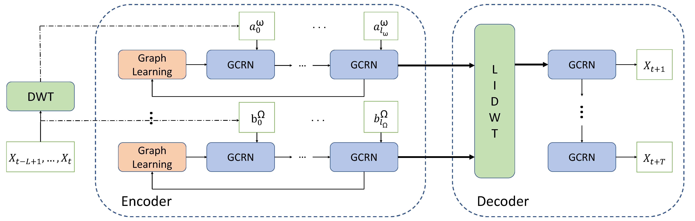
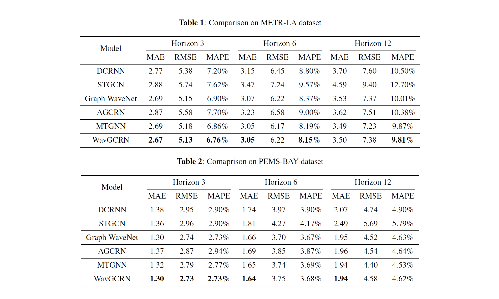

# WavGCRN
This is the origin Pytorch implementation of WavGCRN together with baselines in DGCRN the following paper:
Qipeng Qian, Tanwi Mallick, "Wavelet-Inspired Multiscale Graph Convolutional Recurrent Network for Traffic Forecasting". 

<p align="center">

<br><br>
<b>Figure 1.</b>  Structure of WavGCRN
</p>

## Requirements

- Python 3.6
- numpy == 1.19.4
- pandas == 1.1.1
- torch >= 1.1
- mxnet == 1.4.1
- tensorflow >= 2.4.0

## Data

- The description of METR-LA dataset and PEMS_BAY dataset please refers to the repository of [DCRNN](https://github.com/liyaguang/DCRNN).

## Usage
Commands for training model:

```bash
python train_benchmark.py --model 'model_name' --data 'data_name' >> log.txt 
```

More parameter information can be found in `train_benchmark.py` or the file in the directory of corrsponding model. You can refer to these parameters for experiments, and you can also adjust the parameters to obtain better results.

## <span id="resultslink">Results</span> 

<p align="center">

<br><br>
<b>Figure 2.</b>  Results of benchmark.
</p>


